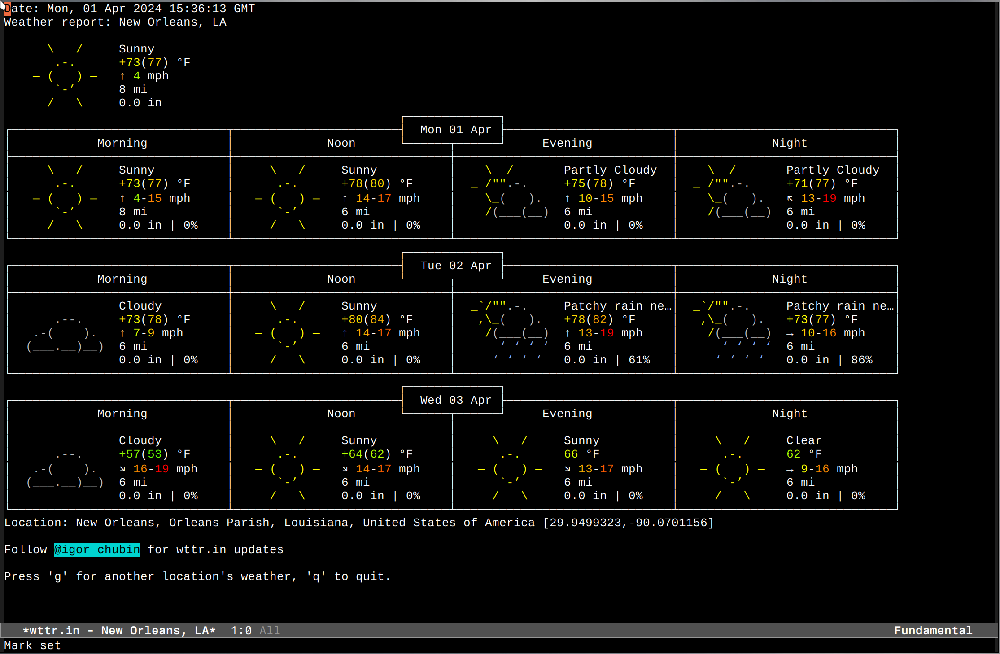

# wttrin.el

Emacs frontend for weather web service [wttr.in](https://wttr.in).

This fork has a few minor improvements:
- It displays the date and time	the weather was displayed.
- It allows for customizing the font and font height used to display.
- On location re-query, the original weather buffer is closed, reducing buffer clutter.
- The license has changed from the MIT license to the GNU General Public License Version 3.

In addition, this fork applies the following patches (from bcbcarl/emacs-wttrin):
- [patch to request the return ascii instead of html](https://github.com/bcbcarl/emacs-wttrin/pull/18) from brannala
- [patch to select the unit system](https://github.com/bcbcarl/emacs-wttrin/pull/10) from RJTK
- [patch to use https instead of http](https://github.com/bcbcarl/emacs-wttrin/pull/15) from relrod

All changes have been manually validated as working as of Monday, April 01, 2024 (not kidding). Automatic CI tests forthcoming.

Bug reports and PRs are welcome. Enjoy!

## USAGE

Set a default cities list for completion:

```elisp
(setq wttrin-default-cities '( "Berkeley, California" "Taipei, Taiwan" "Tainan, Taiwan"))
```

You can also specify default HTTP request Header for Accept-Language:

```elisp
(setq wttrin-default-accept-language '("Accept-Language" . "zh-TW")))
```

As well as the unit system, "m" for metric and "u" for USCS/imperial (the default is to choose based on your location):

```elisp
(setq wttrin-unit-system "m")
```

If you want the weather to display in a monospaced font other than your default, you may specify it:

```elisp
(setq wttrin-font-name "Hack Nerd Font Mono")
```

You can specify the font height as well:

```elisp
(setq wttrin-font-height 120)
```

Then run `M-x wttrin` to display the weather.

After the weather is displayed you may press `q` to quit the buffer or `g` to query the weather for another location.



## INSTALLATION

Since the versions on Melpa and Melpa-stable are broken and abandoned versions, you should avoid installing this package from those repositories. Instead you can install manually.

- Clone this repository
- Add the following in your Emacs config file:

```emacs-lisp
(add-to-list 'load-path "/path/to/the/cloned/emacs-wttrin")
(require 'wttrin)
...
```

or in use-package format:

```emacs-lisp
(use-package wttrin
   :load-path ""/path/to/the/cloned/emacs-wttrin"
   ...)
```

Of if you are using straight, the recipe will be similar to:

```emacs-lisp
(straight-use-package
 '(wttrin :type git
		  :host github
		  :repo "bcbcarl/emacs-wttrin"
		  :fork (:host github
				 :repo "cjennings/emacs-wttrin")))
```

I will contact the Melpa maintainers and update this package with a working version soon.

## LICENSE

GPL-v3
