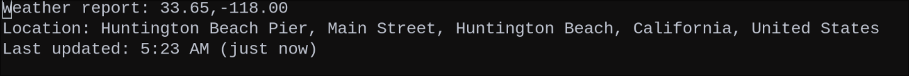

* Wttrin for Emacs

[[#installation][Installation]] | [[#usage][Usage]] | [[#customization][Customization]] | [[#history][History]] | [[#license][License]]

[[https://www.gnu.org/software/emacs/][file:assets/made-for-emacs-badge.svg]]
[[https://melpa.org/#/wttrin][file:https://melpa.org/packages/wttrin-badge.svg]]
[[https://stable.melpa.org/#/wttrin][file:https://stable.melpa.org/packages/wttrin-badge.svg]]
[[https://github.com/cjennings/emacs-wttrin/actions/workflows/ci.yml][file:https://github.com/cjennings/emacs-wttrin/actions/workflows/ci.yml/badge.svg]]
[[https://coveralls.io/github/cjennings/emacs-wttrin?branch=main][file:https://coveralls.io/repos/github/cjennings/emacs-wttrin/badge.svg?branch=main]]

Wttrin is a simple Emacs frontend for Igor Chubin's [[https://github.com/chubin/wttr.in][wttr.in]] weather service. It works with Emacs 24.4+ and needs [[https://github.com/atomontage/xterm-color][xterm-color]] for the colored ASCII art (MELPA handles that dependency for you).

[[assets/wttrin.png]]

" /A change in the weather is sufficient to recreate the world and ourselves./ "
- /Marcel Proust, The Guermantes Way/

** Installation
*** Package Install and Use-Package
Wttrin is on [[https://melpa.org/][MELPA]] and [[https://stable.melpa.org/#/][MELPA Stable]], so I recommend adding a use-package declaration to your Emacs init file. Installing Wttrin, assigning a keybinding, and customizing the location list is as simple as adding the following code and evaluating it.

#+begin_src emacs-lisp
  (use-package wttrin
    :ensure t
    :commands (wttrin)
    :bind ("C-c w" . wttrin)
    :custom
    (wttrin-default-locations '("Bondi Beach" "Taghazout" "Tamarindo" "Huntington Beach")))
#+end_src

With the cursor after the last closing parentheses, press "C-x C-e". Emacs will start the install, assign the keybinding, set the location list, and you'll be ready to go.

*** Package VC Install (Emacs 30+)
If you're running Emacs 30 or later, you can install Wttrin directly from its Git repository using the built-in package-vc system. This is particularly handy if you want to track the latest development or contribute bug fixes.

#+begin_src emacs-lisp
  (use-package wttrin
    :vc (:url "https://github.com/cjennings/emacs-wttrin" :rev :newest)
    :bind ("C-c w" . wttrin)
    :custom
    (wttrin-default-locations '("Jeffreys Bay" "Raglan" "Mundaka")))
#+end_src

The =:vc= keyword handles installation and updates. Run =M-x package-vc-upgrade= to pull the latest.

*** Straight
For the Elisp hackers using Straight for lockfiles or for easy hacking on bug fix PRs, you probably don't need me to tell you what to put in your Emacs init, but here it is anyway.

#+begin_src emacs-lisp
  (straight-use-package
   '(wttrin :type git :host github :repo "cjennings/emacs-wttrin"))
#+end_src

*** Quelpa
If you typically use Quelpa to install from the bleeding edge, here's what to put in your Emacs init:

#+begin_src emacs-lisp
  (quelpa '(wttrin
            :fetcher github :repo "cjennings/emacs-wttrin"))
  (define-key global-map (kbd "C-c w") 'wttrin)
#+end_src

Wttrin is pulled to MELPA repositories regularly, so using Quelpa for Wttrin may provide no advantage over use-package. Regardless, Wttrin's main branch should always be stable, so you'll be fine.

*** Local Development / Manual Install
Wttrin has a dependency on [[https://github.com/atomontage/xterm-color][xterm-color]] to colorize the weather display buffer. When installing from MELPA, xterm-color is automatically installed. For local development or manual installations, ensure xterm-color is available.

**** Using use-package (Recommended for Development)
If you're developing wttrin or using a local clone:

#+begin_src emacs-lisp
  (use-package wttrin
    :load-path "/path/to/emacs-wttrin"
    :defer t
    :bind ("C-c w" . wttrin)
    :custom
    (wttrin-default-locations '("Your City" "Another City")))
#+end_src

*Note:* xterm-color loads automatically when needed. No special `:preface` or `:after` configuration required.

**** Without use-package
If you prefer not to use use-package:

1 - Ensure xterm-color is installed (it will auto-install from MELPA if available via package.el)

2 - Clone the wttrin repository:

#+begin_src sh
  git clone https://github.com/cjennings/emacs-wttrin.git
#+end_src

3 - Add to your Emacs init file:

#+begin_src elisp
  (add-to-list 'load-path "/path/to/emacs-wttrin")
  (require 'wttrin)
  (define-key global-map (kbd "C-c w") 'wttrin)
#+end_src

4 - Evaluate the code with M-x eval-region ⏎ to load the package and set the keybinding.

** Usage
Simply use the keybinding you assigned, or run `M-x wttrin` to display the weather. A list of locations will display.

[[assets/location-menu.png]]

Choose one, or for a quick one-time weather check, type a new location and ⏎ . After the weather is displayed, the footer shows two groups of keys. Keys that act on the view: `a` for another location, `g` to refresh, `q` to quit. Keys that act on your saved locations: `s` to save the shown location, `d` to make it your default, `r` to rename a saved location, and `x` to remove one.

Pressing `d` sets =wttrin-favorite-location= to the location on screen and remembers it across restarts (via savehist), so the mode-line and future sessions follow it. Your default is also offered in the location list the next time you run =M-x wttrin=. Enable =savehist-mode= for the persistence to stick. (On a geolocation-detected buffer, `d` first prompts for a name and saves it — see Naming Locations.)

If you're looking at cached data, a line below the weather art tells you how old it is (e.g., "Last updated: 2:30 PM (5 minutes ago)").

** Customization
Wttrin can be customized using the built-in Emacs Customize interface. To do this, type M-x customize ⏎ wttrin ⏎ and use the UI. However, it's more portable and reproducible to keep the customizations in your init file, so do that.

*Note for Emacs 29+ users:* The examples below use `setq`, which works for all Emacs versions. If you're running Emacs 29.1 or later, you can use `setopt` instead, which provides type checking and runs any custom setter functions. Both work fine for Wttrin.

*** Default Location List

Most people will just want to add a bunch of cities to the location list. However, you should know you can check the weather for places that aren't cities, so here's an example showing several ways to add locations to Wttrin.

#+begin_src emacs-lisp
  (setq wttrin-default-locations
        '("Berkeley, CA"            ;; City and State (to disambiguate)
          "Wellington, New Zealand" ;; City and Country Name
          "~Big+Ben"                ;; The Landmark in London, not whomever you're thinking of
          "70116"                   ;; Zip Code for the French Quarter, New Orleans
          "BCN"                     ;; Airport Code for Barcelona
          "41.89,12.48"))           ;; GPS Coordinates for Rome
#+end_src

*** Location Search History

Locations you search successfully are remembered and offered as completion candidates the next time you run =M-x wttrin=, after your saved and default locations. Only successful lookups are saved, so typos and not-found locations never enter the history. Entries already offered elsewhere are not duplicated into the history: defaults, saved-location names (see Naming Locations), and raw =lat,lng= coordinates from geolocation are all kept out.

History is capped at =wttrin-location-history-max= entries (default 20); the oldest fall off as new ones arrive.

#+begin_src emacs-lisp
  (setq wttrin-location-history-max 20)
#+end_src

To persist the history across Emacs restarts, enable the built-in =savehist-mode=. Wttrin keeps its history variable registered automatically, even if you set =savehist-additional-variables= yourself, so there is nothing else to configure. Without =savehist-mode=, history lasts for the session only.

#+begin_src emacs-lisp
  (savehist-mode 1)
#+end_src

Two commands manage the history: =M-x wttrin-remove-location-history= drops a single entry (with completion), and =M-x wttrin-clear-location-history= clears all of it.

*** Default Language
Customizing 'wttrin-default-languages' allows users to tell Wttrin which language to request for the text it displays. For instance, this changes the language used for days of the week, periods of the day, and other related text.

Wttrin's default is currently: "en-US,en;q=0.8,zh-CN;q=0.6,zh;q=0.4",

This means Wttrin defaults to American English, then falls back to any other type of English, Simplified Chinese, then finally any other type of Chinese. Of course that doesn't even begin to account for everyone's use case, so here's what you need to know to customize this.

Language codes usually follow the format of a primary language tag in lowercase (like "en" for English, "fr" for French, "zh" for Chinese), optionally with a region subtag in capitals (like "US" for United States or "CN" for China). If you use both, add a hyphen between them. You can enter just "en", but you may want to enter "en-GB" to avoid seeing how we trash the King's English on this side of the pond.

To have Wttrin render in Traditional Chinese:

#+begin_src emacs-lisp
  (setq wttrin-default-languages '("Accept-Language" . "zh-TW"))
#+end_src

And to have Wttrin render in  French:

#+begin_src emacs-lisp
  (setq wttrin-default-languages '("Accept-Language" . "fr-FR"))
#+end_src

Where to look up language codes? The IETF's BCP 47 official reference is online [[https://www.iana.org/assignments/language-subtag-registry/language-subtag-registry][here]]. But those who were quick to open that link now know why I recommend [[https://r12a.github.io/app-subtags/][this search interface]].

*** Display Font and Size
The default font is "Liberation Mono" because it's libre and ubiquitous on Linux distributions. Don't worry, Emacs will find another monospaced font if that one's not installed. However, if you need to use your favorite monospaced font so Wttrin blends in with the rest of your Emacs Feng Shui, here you go:

#+begin_src emacs-lisp
  (setq wttrin-font-name "Hack Nerd Font Mono")
#+end_src

You can change the font size by changing the font height. The default is 130. Note that Emacs uses the "canonical character height", which is 1/10th of a font point. For example, if you want a 12 point font size, you'd choose a font-height of 120.

#+begin_src emacs-lisp
  (setq wttrin-font-height 120)
#+end_src

*** Unit System
Wttrin's default is to select the unit system appropriate for the location you query. If you'd rather see everything in the units you're used to:

#+begin_src emacs-lisp
  (setq wttrin-unit-system "m") ;; for Metric units
  (setq wttrin-unit-system "u") ;; for USCS/Imperial units
  (setq wttrin-unit-system nil) ;; the default of using units appropriate for the queried location.
#+end_src

*** Display Options
wttr.in supports a handful of single-character flags that change what the report looks like. Concatenate them in =wttrin-display-options= and they'll be appended to every request:

#+begin_src emacs-lisp
  (setq wttrin-display-options "0Fq")  ;; current weather only, no Follow line, no header
  (setq wttrin-display-options "n")    ;; narrow version (only day and night)
  (setq wttrin-display-options nil)    ;; default (all options off)
#+end_src

The full list of flags is at https://wttr.in/:help. Skip =A= and =T= — wttrin manages ANSI output internally so the colored glyphs render correctly.

*** Cache Settings
Wttrin caches weather data and refreshes it in the background. By default it refreshes every hour and keeps up to 50 entries. You can adjust both:

#+begin_src emacs-lisp
  (setq wttrin-refresh-interval (* 30 60))  ;; Refresh every 30 minutes (in seconds)
  (setq wttrin-cache-max-entries 100)       ;; Store up to 100 cached locations
#+end_src

To manually clear all cached data, run =M-x wttrin-clear-cache=.

*** Mode-line Weather Display
Wttrin can show a weather emoji for your favorite location right in the mode-line. It refreshes hourly in the background, and hovering over it gives you the full picture — location, temperature, conditions, and when the data was last fetched.

**** Basic Setup
To enable the mode-line weather display, set your favorite location and enable auto-start:

#+begin_src emacs-lisp
  (use-package wttrin
    :ensure t
    :custom
    (wttrin-favorite-location "Berkeley, CA")
    (wttrin-mode-line-auto-enable t))
#+end_src

Alternatively, you can manually toggle the mode-line display:

#+begin_src emacs-lisp
  (wttrin-mode-line-mode 1)  ;; Enable
  (wttrin-mode-line-mode 0)  ;; Disable
#+end_src

**** What it does
The mode-line shows a color emoji (☀️ 🌧️ ⛅ etc.) that updates hourly. Left-click opens the full weather buffer. Right-click forces a refresh.

If a refresh fails, the emoji dims to gray and the tooltip tells you what went wrong and when it'll retry. Once the connection comes back, everything returns to normal on its own.

**** Customization

#+begin_src emacs-lisp
  ;; Set your favorite location (required for mode-line display)
  (setq wttrin-favorite-location "New Orleans, LA")

  ;; Auto-enable mode-line weather on startup
  (setq wttrin-mode-line-auto-enable t)

  ;; Adjust refresh interval (in seconds, default is 3600 = 1 hour)
  (setq wttrin-mode-line-refresh-interval (* 30 60))  ;; Refresh every 30 minutes

  ;; Choose emoji font for color display (common options)
  (setq wttrin-mode-line-emoji-font "Apple Color Emoji")   ;; macOS
  (setq wttrin-mode-line-emoji-font "Noto Color Emoji")    ;; Linux (default)
  (setq wttrin-mode-line-emoji-font "Segoe UI Emoji")      ;; Windows
  (setq wttrin-mode-line-emoji-font nil)                   ;; Use default font

  ;; How long to wait before the first fetch (1-10 seconds, default 3)
  ;; Useful if your network is slow to come up after Emacs starts
  (setq wttrin-mode-line-startup-delay 5)
#+end_src

*Note:* If the weather emoji appears as a monochrome symbol instead of a color icon, try setting `wttrin-mode-line-emoji-font` to match a color emoji font installed on your system. Use `M-x fc-list` or check your system fonts to see what's available.

*** Weather for Your Current Location
If you don't want to type your city by hand, wttrin can detect it for you.

**From the picker (weather here, right now):** run =M-x wttrin= and pick the first entry, "Current location (detect)". wttrin looks up your city via IP geolocation and shows its weather. If the guess is wrong (VPN, mobile hotspot), the detected city is right there in the buffer header, so just open the picker again and type the correct city.

**Make the detected city your default:** in that weather buffer, press =d=. The detected city becomes =wttrin-favorite-location= (what the mode-line tracks). With =savehist-mode= on, the favorite persists across sessions automatically, since wttrin registers it with savehist. No =customize-save-variable= step is needed.

**Always use my current location:** run =M-x wttrin-use-current-location=, or set the variable directly:

#+begin_src emacs-lisp
  (setq wttrin-favorite-location t)
#+end_src

When set to =t=, wttrin runs the geolocation lookup once on first use (when the mode-line first fetches, when the buffer cache first refreshes, etc.) and caches the result for the rest of the session. The lookup happens in the background, so Emacs startup isn't blocked. The first display tick shows a placeholder until the lookup returns; everything proceeds normally after that. =M-x wttrin-use-current-location= is the labeled, confirmed way to choose this without typing the bare =t=.

The default lookup provider is =ipapi.co=. Two alternatives ship with the package, both free and key-less:

#+begin_src emacs-lisp
  (setq wttrin-geolocation-provider 'ipapi)    ;; ipapi.co (default, 30k/month)
  (setq wttrin-geolocation-provider 'ipinfo)   ;; ipinfo.io (50k/month)
  (setq wttrin-geolocation-provider 'ipwhois)  ;; ipwho.is (10k/month)
#+end_src

*Note:* IP-based geolocation can be wrong when you are behind a VPN or using a mobile hotspot. If you prefer, set =wttrin-favorite-location= directly to any city string that wttr.in understands.

**Higher accuracy via an external command:** IP geolocation only finds your network's exit point, which on a VPN or cellular hotspot can be the wrong city or state. For a more accurate fix, point =wttrin-geolocation-command= at a command that returns your coordinates as JSON:

#+begin_src emacs-lisp
  (setq wttrin-geolocation-command "your-location-script --json")
#+end_src

The command runs asynchronously and must print a JSON object with numeric =lat= and =lng= keys. It may also include an =address= (or =label=) string; when present, wttrin shows it on a "Location:" line in the weather buffer so the resolved place is readable even though the weather is fetched by raw coordinates. Any other keys are ignored. For example:

#+begin_src json
  {"lat": 41.3222, "lng": -71.8113, "address": "Westerly, Rhode Island, USA"}
#+end_src

wttrin queries wttr.in by the coordinates and lets it echo the place name in its own header. A command that scans nearby WiFi access points and looks them up (far more accurate than IP) is the typical source. The package ships no command and assumes nothing about your system, so this is inert until you set it. If the command is unset, exits non-zero, or prints no usable coordinates, wttrin falls back to the IP provider above.

The resolved coordinates show in the header, with the readable place on the "Location:" line below:

Two ready-to-adapt example commands live in [[file:examples/geolocation/][examples/geolocation/]]: =google-geolocate.py= (Google Geolocation API, needs a key) and =apple-wps.py= (Apple's keyless WiFi positioning, which uses an undocumented endpoint — read its caveat). Both are Python 3 standard library, scan WiFi via =nmcli=, and print the JSON described above. See that directory's README for setup.

The older =M-x wttrin-set-location-from-geolocation= command still works but is deprecated in favor of the picker entry above.

**Turning geolocation off:** geolocation is on by default. To opt out — no "Current location" entry in the picker, no detection requests — set:

#+begin_src emacs-lisp
  (setq wttrin-geolocation-enabled nil)
#+end_src

*** Naming Locations
A saved location has a friendly name and a separate query: =wttrin= shows the name in the picker, the buffer header, and the mode-line, but fetches weather for the query. That lets a precise query hide behind a readable name — "Superdome" rather than "1500 Sugar Bowl Dr, New Orleans". The query can be a city, a full address, or =lat,lng= coordinates.

Set them in your init:

#+begin_src emacs-lisp
  (setq wttrin-saved-locations
        '(("Superdome" . "1500 Sugar Bowl Dr, New Orleans")
          ("Home"      . "41.37,-71.83")))
#+end_src

Or build the directory interactively:

- =M-x wttrin-save-location= — save the place in the current weather buffer (or a typed query) under a name. Saving an existing name updates its query.
- =M-x wttrin-rename-location= — rename an entry (refused if the new name is already taken).
- =M-x wttrin-remove-location= — remove an entry (asks to confirm).

The directory persists across sessions with =savehist-mode= on (=wttrin= registers it), the same as your favorite and history.

You can point =wttrin-favorite-location= at a saved name (e.g. ="Craig's House"=): the mode-line resolves it to the query for fetching but shows the name in the tooltip.

When you pick "Current location (detect)" and press =d= to keep it, =wttrin= prompts for a name (prefilled with the detected address) and saves it as a named location, then makes it your default. Clear the field and press RET to keep the raw coordinates instead. Raw coordinates never clutter your history; only named places are remembered.

*Privacy:* a saved query can be a home or work street address, kept in plaintext in your savehist file. With =wttrin-debug= on, the query and raw responses are also written to the debug log. =wttrin= does not encrypt or redact these, so save what you're comfortable storing in plain text.

*** Theming the Faces
The text wttrin draws itself uses named faces, so themes and =M-x customize-face= can restyle it. (The weather art itself is colored by the ANSI codes wttr.in returns, not by these faces.)

| Face                         | Styles                                     | Default                  |
|------------------------------+--------------------------------------------+--------------------------|
| =wttrin-mode-line-stale=     | the mode-line emoji when its data is stale | inherits =shadow=        |
|------------------------------+--------------------------------------------+--------------------------|
| =wttrin-staleness-header=    | the "Last updated:" and "Location:" lines  | inherits =shadow=        |
|------------------------------+--------------------------------------------+--------------------------|
| =wttrin-instructions=        | the footer key labels                      | inherits =shadow=        |
|------------------------------+--------------------------------------------+--------------------------|
| =wttrin-instructions-header= | the footer column headers                  | inherits =(bold shadow)= |
|------------------------------+--------------------------------------------+--------------------------|
| =wttrin-key=                 | the bracketed key chords ([a] [g] [q])     | inherits =bold=          |

Restyle them in your init file like any other face:

#+begin_src emacs-lisp
  (set-face-attribute 'wttrin-key nil :foreground "deep sky blue" :weight 'bold)
  (set-face-attribute 'wttrin-staleness-header nil :slant 'italic)
#+end_src

** Debugging and Troubleshooting
If something isn't working, debug mode logs every fetch, every display update, and every error.

*** Enabling Debug Mode
*Important:* =wttrin-debug= must be set *before* wttrin loads — it's checked at load time. In use-package, that means =:preface=, not =:custom=.

**** For use-package installations:
#+begin_src emacs-lisp
  (use-package wttrin
    :ensure t
    :preface
    ;; Set debug BEFORE wttrin loads
    (setq wttrin-debug t)
    :custom
    (wttrin-favorite-location "Your City"))
#+end_src

*❌ This will NOT work* (debug set too late):
#+begin_src emacs-lisp
  (use-package wttrin
    :ensure t
    :custom
    (wttrin-debug t)  ;; TOO LATE - wttrin already loaded!
    (wttrin-favorite-location "Your City"))
#+end_src

**** For manual/development installations:
#+begin_src emacs-lisp
  ;; Set debug BEFORE loading wttrin
  (setq wttrin-debug t)
  (add-to-list 'load-path "/path/to/emacs-wttrin")
  (require 'wttrin)
#+end_src

*** Viewing Debug Output
Run =M-x wttrin-debug-show-log= to see a timestamped log of fetch attempts, responses, display updates, and errors.

*** Example Debug Output
When working correctly, the debug log looks like:
#+begin_example
[11:51:46.490] mode-line-fetch: Starting fetch for Berkeley, CA
[11:51:46.490] mode-line-fetch: URL = https://wttr.in/Berkeley%2C%20CA?format=%l:+%c+%t+%C
[11:51:46.921] mode-line-fetch: Received data = "berkeley, ca: ☀️ +62°F Clear"
[11:51:46.921] mode-line-display: Updating from cache, stale=nil
[11:51:46.921] mode-line-display: Extracted emoji = "☀", stale = nil
#+end_example

*** Common Issues
- *xterm-color missing*: Ensure xterm-color is installed (`M-x package-install RET xterm-color`). It loads automatically when wttrin displays weather.
- *Debug not working*: Remember to set `wttrin-debug t` *before* loading wttrin (use `:preface` in use-package)
- *Mode-line not showing*: Check `M-x wttrin-debug-show-log` to see if fetch succeeded
- *No network access*: Debug log will show "Network error" messages

** History
Wttrin was originally the work of Carl X. Su and Ono Hiroko. All credit and appreciation for the original idea and code is theirs, not mine. Over time the package stopped working due to the inevitablity of bit-rot and Emacs's own evolution. I loved using this package, so I adopted Wttrin to maintain and evolve for the Emacs community, and as thanks to the original authors.

Please consider this repository as Wttrin's new home and I'll throw out a welcome mat. I am grateful for any and all bug reports, enhancement requests, and PRs, so feel free to send them my way.

** License
GPL-v3.0 or later
