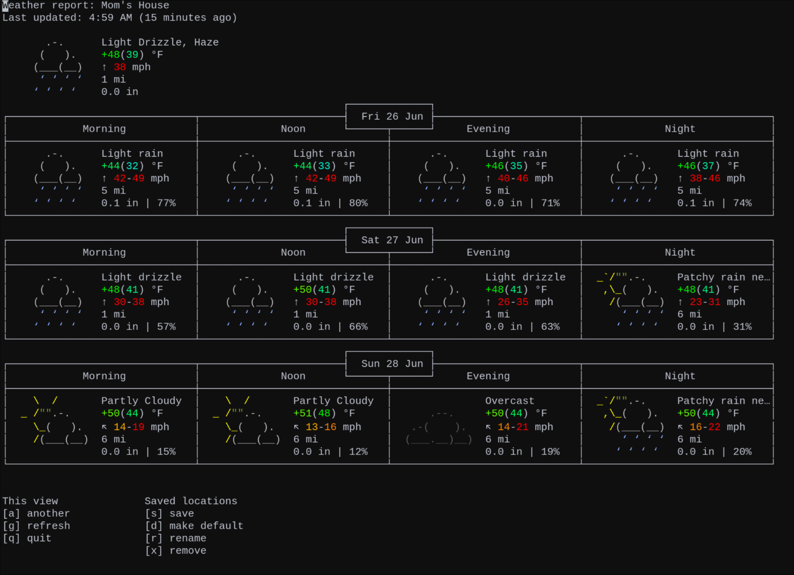
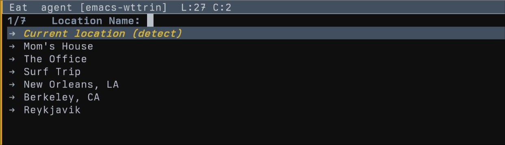

* Wttrin for Emacs

[[#installation][Installation]] | [[#usage][Usage]] | [[#customization][Customization]] | [[#history][History]] | [[#license][License]]

[[https://www.gnu.org/software/emacs/][file:assets/made-for-emacs-badge.svg]]
[[https://melpa.org/#/wttrin][file:https://melpa.org/packages/wttrin-badge.svg]]
[[https://stable.melpa.org/#/wttrin][file:https://stable.melpa.org/packages/wttrin-badge.svg]]

Wttrin is a simple Emacs frontend for Igor Chubin's [[https://github.com/chubin/wttr.in][wttr.in]] weather service. It works with Emacs 24.4+ and needs [[https://github.com/atomontage/xterm-color][xterm-color]] for the colored ASCII art (MELPA handles that dependency for you).

" /A change in the weather is sufficient to recreate the world and ourselves./ "
- /Marcel Proust, The Guermantes Way/

** Installation
*** Package Install and Use-Package
Wttrin is on [[https://melpa.org/][MELPA]] and [[https://stable.melpa.org/#/][MELPA Stable]], so I recommend adding a use-package declaration to your Emacs init file. Installing Wttrin, assigning a keybinding, and customizing the location list is as simple as adding the following code and evaluating it.

#+begin_src emacs-lisp
  (use-package wttrin
    :ensure t
    :commands (wttrin)
    :bind ("C-c w" . wttrin)
    :custom
    (wttrin-default-locations '("Bondi Beach" "Taghazout" "Tamarindo" "Huntington Beach")))
#+end_src

With the cursor after the last closing parentheses, press "C-x C-e". Emacs will start the install, assign the keybinding, set the location list, and you'll be ready to go.

*** Package VC Install (Emacs 30+)
If you're running Emacs 30 or later, you can install Wttrin directly from its Git repository using the built-in package-vc system. This is particularly handy if you want to track the latest development or contribute bug fixes.

#+begin_src emacs-lisp
  (use-package wttrin
    :vc (:url "https://github.com/cjennings/emacs-wttrin" :rev :newest)
    :bind ("C-c w" . wttrin)
    :custom
    (wttrin-default-locations '("Jeffreys Bay" "Raglan" "Mundaka")))
#+end_src

The =:vc= keyword handles installation and updates. Run =M-x package-vc-upgrade= to pull the latest.

*** Straight
For the Elisp hackers using Straight for lockfiles or for easy hacking on bug fix PRs, you probably don't need me to tell you what to put in your Emacs init, but here it is anyway.

#+begin_src emacs-lisp
  (straight-use-package
   '(wttrin :type git :host github :repo "cjennings/emacs-wttrin"))
#+end_src

*** Quelpa
If you typically use Quelpa to install from the bleeding edge, here's what to put in your Emacs init:

#+begin_src emacs-lisp
  (quelpa '(wttrin
            :fetcher github :repo "cjennings/emacs-wttrin"))
  (define-key global-map (kbd "C-c w") 'wttrin)
#+end_src

Wttrin is pulled to MELPA repositories regularly, so using Quelpa for Wttrin may provide no advantage over use-package. Regardless, Wttrin's main branch should always be stable, so you'll be fine.

*** Local Development / Manual Install
Wttrin has a dependency on [[https://github.com/atomontage/xterm-color][xterm-color]] to colorize the weather display buffer. When installing from MELPA, xterm-color is automatically installed. For local development or manual installations, ensure xterm-color is available.

**** Using use-package (Recommended for Development)
If you're developing wttrin or using a local clone:

#+begin_src emacs-lisp
  (use-package wttrin
    :load-path "/path/to/emacs-wttrin"
    :defer t
    :bind ("C-c w" . wttrin)
    :custom
    (wttrin-default-locations '("Your City" "Another City")))
#+end_src

*Note:* xterm-color loads automatically when needed. No special `:preface` or `:after` configuration required.

**** Without use-package
If you prefer not to use use-package:

1 - Ensure xterm-color is installed (it will auto-install from MELPA if available via package.el)

2 - Clone the wttrin repository:

#+begin_src sh
  git clone https://github.com/cjennings/emacs-wttrin.git
#+end_src

3 - Add to your Emacs init file:

#+begin_src elisp
  (add-to-list 'load-path "/path/to/emacs-wttrin")
  (require 'wttrin)
  (define-key global-map (kbd "C-c w") 'wttrin)
#+end_src

4 - Evaluate the code with M-x eval-region ⏎ to load the package and set the keybinding.

** Usage
Simply use the keybinding you assigned, or run `M-x wttrin` to display the weather. A list of locations will display.

Choose one, or for a quick one-time weather check, type a new location and ⏎ . After the weather is displayed, you can press `a` to check another location, `g` to refresh, or `q` to quit.

If you're looking at cached data, a line below the weather art tells you how old it is (e.g., "Last updated: 2:30 PM (5 minutes ago)").

** Customization
Wttrin can be customized using the built-in Emacs Customize interface. To do this, type M-x customize ⏎ wttrin ⏎ and use the UI. However, it's more portable and reproducible to keep the customizations in your init file, so do that.

*Note for Emacs 29+ users:* The examples below use `setq`, which works for all Emacs versions. If you're running Emacs 29.1 or later, you can use `setopt` instead, which provides type checking and runs any custom setter functions. Both work fine for Wttrin.

*** Default Location List

Most people will just want to add a bunch of cities to the location list. However, you should know you can check the weather for places that aren't cities, so here's an example showing several ways to add locations to Wttrin.

#+begin_src emacs-lisp
  (setq wttrin-default-locations
        '("Berkeley, CA"            ;; City and State (to disambiguate)
          "Wellington, New Zealand" ;; City and Country Name
          "~Big+Ben"                ;; The Landmark in London, not whomever you're thinking of
          "70116"                   ;; Zip Code for the French Quarter, New Orleans
          "BCN"                     ;; Airport Code for Barcelona
          "41.89,12.48"))           ;; GPS Coordinates for Rome
#+end_src

*** Default Language
Customizing 'wttrin-default-languages' allows users to tell Wttrin which language to request for the text it displays. For instance, this changes the language used for days of the week, periods of the day, and other related text.

Wttrin's default is currently: "en-US,en;q=0.8,zh-CN;q=0.6,zh;q=0.4",

This means Wttrin defaults to American English, then falls back to any other type of English, Simplified Chinese, then finally any other type of Chinese. Of course that doesn't even begin to account for everyone's use case, so here's what you need to know to customize this.

Language codes usually follow the format of a primary language tag in lowercase (like "en" for English, "fr" for French, "zh" for Chinese), optionally with a region subtag in capitals (like "US" for United States or "CN" for China). If you use both, add a hyphen between them. You can enter just "en", but you may want to enter "en-GB" to avoid seeing how we trash the King's English on this side of the pond.

To have Wttrin render in Traditional Chinese:

#+begin_src emacs-lisp
  (setq wttrin-default-languages '("Accept-Language" . "zh-TW"))
#+end_src

And to have Wttrin render in  French:

#+begin_src emacs-lisp
  (setq wttrin-default-languages '("Accept-Language" . "fr-FR"))
#+end_src

Where to look up language codes? The IETF's BCP 47 official reference is online [[https://www.iana.org/assignments/language-subtag-registry/language-subtag-registry][here]]. But those who were quick to open that link now know why I recommend [[https://r12a.github.io/app-subtags/][this search interface]].

*** Display Font and Size
The default font is "Liberation Mono" because it's libre and ubiquitous on Linux distributions. Don't worry, Emacs will find another monospaced font if that one's not installed. However, if you need to use your favorite monospaced font so Wttrin blends in with the rest of your Emacs Feng Shui, here you go:

#+begin_src emacs-lisp
  (setq wttrin-font-name "Hack Nerd Font Mono")
#+end_src

You can change the font size by changing the font height. The default is 130. Note that Emacs uses the "canonical character height", which is 1/10th of a font point. For example, if you want a 12 point font size, you'd choose a font-height of 120.

#+begin_src emacs-lisp
  (setq wttrin-font-height 120)
#+end_src

*** Unit System
Wttrin's default is to select the unit system appropriate for the location you query. If you'd rather see everything in the units you're used to:

#+begin_src emacs-lisp
  (setq wttrin-unit-system "m") ;; for Metric units
  (setq wttrin-unit-system "u") ;; for USCS/Imperial units
  (setq wttrin-unit-system nil) ;; the default of using units appropriate for the queried location.
#+end_src

*** Cache Settings
Wttrin caches weather data and refreshes it in the background. By default it refreshes every hour and keeps up to 50 entries. You can adjust both:

#+begin_src emacs-lisp
  (setq wttrin-refresh-interval (* 30 60))  ;; Refresh every 30 minutes (in seconds)
  (setq wttrin-cache-max-entries 100)       ;; Store up to 100 cached locations
#+end_src

To manually clear all cached data, run =M-x wttrin-clear-cache=.

*** Mode-line Weather Display
Wttrin can show a weather emoji for your favorite location right in the mode-line. It refreshes hourly in the background, and hovering over it gives you the full picture — location, temperature, conditions, and when the data was last fetched.

**** Basic Setup
To enable the mode-line weather display, set your favorite location and enable auto-start:

#+begin_src emacs-lisp
  (use-package wttrin
    :ensure t
    :custom
    (wttrin-favorite-location "Berkeley, CA")
    (wttrin-mode-line-auto-enable t))
#+end_src

Alternatively, you can manually toggle the mode-line display:

#+begin_src emacs-lisp
  (wttrin-mode-line-mode 1)  ;; Enable
  (wttrin-mode-line-mode 0)  ;; Disable
#+end_src

**** What it does
The mode-line shows a color emoji (☀️ 🌧️ ⛅ etc.) that updates hourly. Left-click opens the full weather buffer. Right-click forces a refresh.

If a refresh fails, the emoji dims to gray and the tooltip tells you what went wrong and when it'll retry. Once the connection comes back, everything returns to normal on its own.

**** Customization

#+begin_src emacs-lisp
  ;; Set your favorite location (required for mode-line display)
  (setq wttrin-favorite-location "New Orleans, LA")

  ;; Auto-enable mode-line weather on startup
  (setq wttrin-mode-line-auto-enable t)

  ;; Adjust refresh interval (in seconds, default is 3600 = 1 hour)
  (setq wttrin-mode-line-refresh-interval (* 30 60))  ;; Refresh every 30 minutes

  ;; Choose emoji font for color display (common options)
  (setq wttrin-mode-line-emoji-font "Apple Color Emoji")   ;; macOS
  (setq wttrin-mode-line-emoji-font "Noto Color Emoji")    ;; Linux (default)
  (setq wttrin-mode-line-emoji-font "Segoe UI Emoji")      ;; Windows
  (setq wttrin-mode-line-emoji-font nil)                   ;; Use default font

  ;; How long to wait before the first fetch (1-10 seconds, default 3)
  ;; Useful if your network is slow to come up after Emacs starts
  (setq wttrin-mode-line-startup-delay 5)
#+end_src

*Note:* If the weather emoji appears as a monochrome symbol instead of a color icon, try setting `wttrin-mode-line-emoji-font` to match a color emoji font installed on your system. Use `M-x fc-list` or check your system fonts to see what's available.

*** Setting the Favorite Location from IP Geolocation
If you don't want to type your city by hand, wttrin can detect it for you:

#+begin_src emacs-lisp
  M-x wttrin-set-location-from-geolocation
#+end_src

This looks up your city via IP geolocation, shows the detected location, and sets =wttrin-favorite-location= after you confirm. To make the setting persist across Emacs sessions, run =M-x customize-save-variable RET wttrin-favorite-location RET=, or add =(setq wttrin-favorite-location "Your City, State")= to your init file.

The default lookup provider is =ipapi.co=. Two alternatives ship with the package, both free and key-less:

#+begin_src emacs-lisp
  (setq wttrin-geolocation-provider 'ipapi)    ;; ipapi.co (default, 30k/month)
  (setq wttrin-geolocation-provider 'ipinfo)   ;; ipinfo.io (50k/month)
  (setq wttrin-geolocation-provider 'ipwhois)  ;; ipwho.is (10k/month)
#+end_src

*Note:* IP-based geolocation can be wrong when you are behind a VPN or using a mobile hotspot. The confirmation prompt lets you reject an inaccurate result. If you prefer, set =wttrin-favorite-location= directly to any city string that wttr.in understands.

** Debugging and Troubleshooting
If something isn't working, debug mode logs every fetch, every display update, and every error.

*** Enabling Debug Mode
*Important:* =wttrin-debug= must be set *before* wttrin loads — it's checked at load time. In use-package, that means =:preface=, not =:custom=.

**** For use-package installations:
#+begin_src emacs-lisp
  (use-package wttrin
    :ensure t
    :preface
    ;; Set debug BEFORE wttrin loads
    (setq wttrin-debug t)
    :custom
    (wttrin-favorite-location "Your City"))
#+end_src

*❌ This will NOT work* (debug set too late):
#+begin_src emacs-lisp
  (use-package wttrin
    :ensure t
    :custom
    (wttrin-debug t)  ;; TOO LATE - wttrin already loaded!
    (wttrin-favorite-location "Your City"))
#+end_src

**** For manual/development installations:
#+begin_src emacs-lisp
  ;; Set debug BEFORE loading wttrin
  (setq wttrin-debug t)
  (add-to-list 'load-path "/path/to/emacs-wttrin")
  (require 'wttrin)
#+end_src

*** Viewing Debug Output
Run =M-x wttrin-debug-show-log= to see a timestamped log of fetch attempts, responses, display updates, and errors.

*** Example Debug Output
When working correctly, the debug log looks like:
#+begin_example
[11:51:46.490] mode-line-fetch: Starting fetch for Berkeley, CA
[11:51:46.490] mode-line-fetch: URL = https://wttr.in/Berkeley%2C%20CA?format=%l:+%c+%t+%C
[11:51:46.921] mode-line-fetch: Received data = "berkeley, ca: ☀️ +62°F Clear"
[11:51:46.921] mode-line-display: Updating from cache, stale=nil
[11:51:46.921] mode-line-display: Extracted emoji = "☀", stale = nil
#+end_example

*** Common Issues
- *xterm-color missing*: Ensure xterm-color is installed (`M-x package-install RET xterm-color`). It loads automatically when wttrin displays weather.
- *Debug not working*: Remember to set `wttrin-debug t` *before* loading wttrin (use `:preface` in use-package)
- *Mode-line not showing*: Check `M-x wttrin-debug-show-log` to see if fetch succeeded
- *No network access*: Debug log will show "Network error" messages

** History
Wttrin was originally the work of Carl X. Su and Ono Hiroko. All credit and appreciation for the original idea and code is theirs, not mine. Over time the package stopped working due to the inevitablity of bit-rot and Emacs's own evolution. I loved using this package, so I adopted Wttrin to maintain and evolve for the Emacs community, and as thanks to the original authors.

Please consider this repository as Wttrin's new home and I'll throw out a welcome mat. I am grateful for any and all bug reports, enhancement requests, and PRs, so feel free to send them my way.

** License
GPL-v3.0 or later
